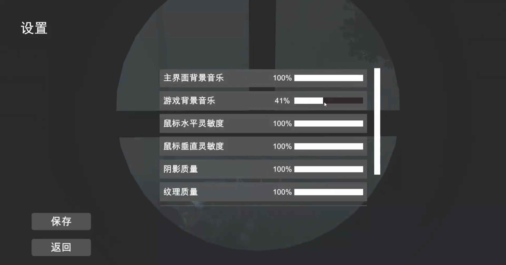
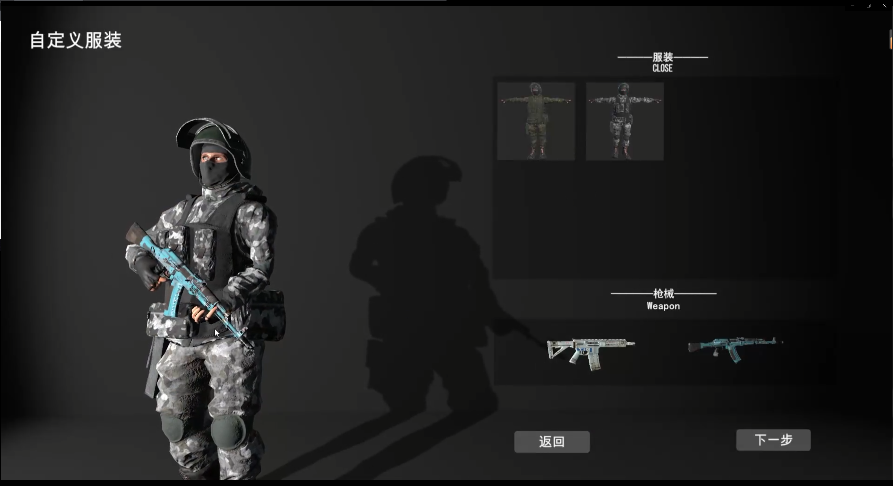
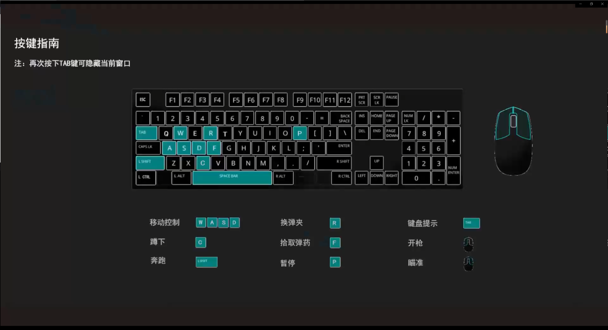
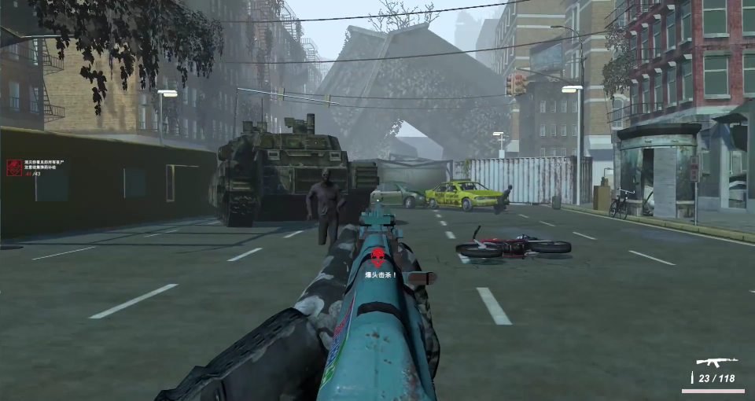
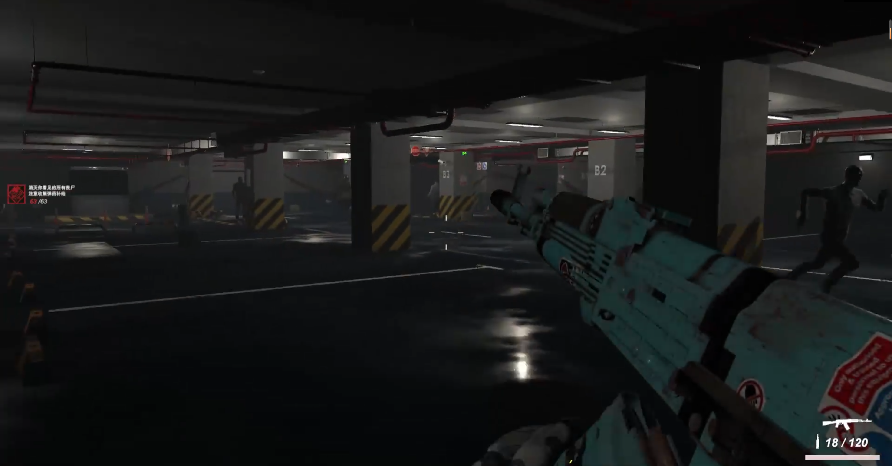
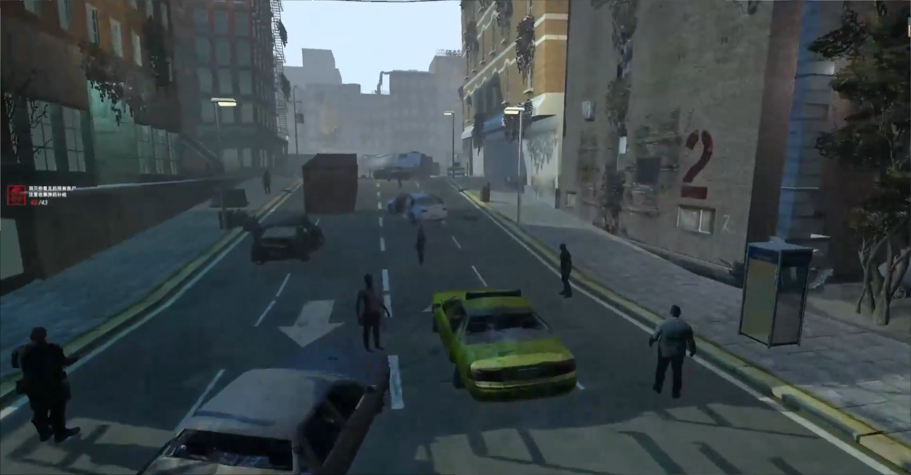
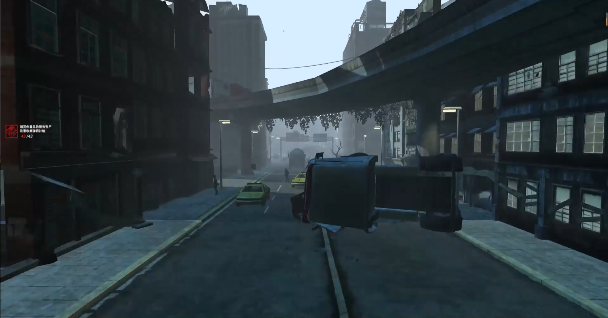

## 绝境逃生【腾讯高校游戏创意大赛的参赛作品】

项目链接：https://github.com/Li-ZhuoHang/Desperate_Escape.git

### 负责的技术部分：

1. 与世界物体进行交互和游戏道具的制作 
2. 敌人AI的的设计和制作
3. 游戏UI框架的搭建
4. UE4场景材质的制作

### 描述：

该游戏为一款基于UE4引擎开发的丧尸题材FPS游戏，游戏采用采用C++和蓝图编程，玩家将扮演一名幸存者，在末日世界中寻找资源、武器和同伴，与无尽的僵尸大军作战，寻找生存的希望。

### 图片展示：

##### 游戏UI界面展示：

##### 游戏战斗画面:

##### 游戏场景：

